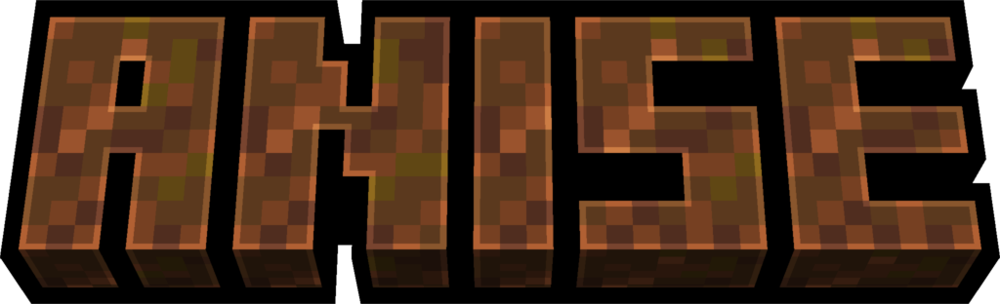

# Description
Anise is a simple modpack with 3 main goals:
- Make player feel more like a glass cannon
- Add more steps to progression
- And of course, some new content sprinkled in ;)
# Progression changes
All tools besides wood tier require smithing table and a common upgrade template (made from pebbles and canvas/leather). Stone tools are replaced with copper tools and gold is now on par with iron. Crystals need polishing before usage with either sand paper or grindstone.
# Credits
- Modpack by licorice45
- Tested by [Codist](https://imcodist.xyz/)
- List of mods can be found [here](https://github.com/licorice45/anise-modpack/blob/main/mods_list.md)
